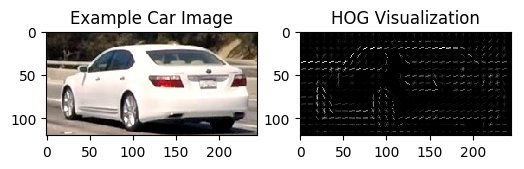
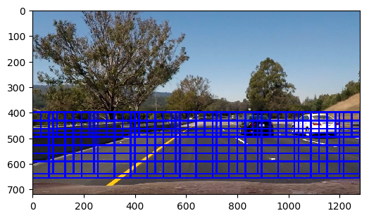
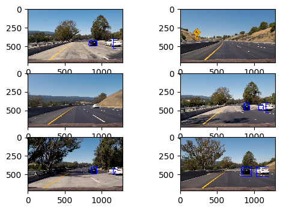
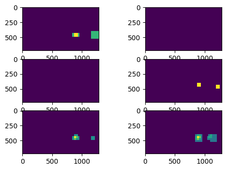

# Vehicle Detection Report
**Introduction**

The goal of the project is to create a pipeline, being able to identify cars on the road. To achieve that, the following steps are performed and analyzed:

* Perform a Histogram of Oriented Gradients (HOG) feature extraction on a labeled training set of images and train a classifier Linear SVM classifier
* Optionally, apply a color transform and append binned color features, as well as histograms of color, to the HOG feature vector. 
* Implement a sliding-window technique and use the trained classifier to search for vehicles in images.
* Run your pipeline on a video stream and create a heat map of recurring detections frame by frame to reject outliers and follow detected vehicles.
* Estimate a bounding box for vehicles detected.

The following paragraphs address each point of the project. The code consists of the following python files:

**Top level files **: These files are executed on their own

* `vehicle_train_classifier`: Creates the features and trains an SVC classifier for vehicle detection, that is saved into a pickle file
* `vehicle_tracking_pipeline`: The main pipeline for the vehicle detection using the classifier from the previous file
* `vehicle_tracking_pipeline_image`: The same pipeline applied to a single image

**Functions**

* `vehicle_detection_functions`: All the necessary functions required for the vehicle detection. Details follow throughout the report
* `heatmap_functions`: The heatmap function required for eliminating false positives and duplicates in the detection

---
### Writeup / README

#### 1. Provide a Writeup / README that includes all the rubric points and how you addressed each one.

The current document.

### Histogram of Oriented Gradients (HOG)

#### 1. Explain how (and identify where in your code) you extracted HOG features from the training images.

In the `vehicle_train_classifier` file, the training images for cars and notcars are first extracted. Then, from lines 32-55, the `extract_features` function is creating the features array, consisting of hog, spatial and colour histogram features. The function is located in the `vehicle_detection_functions`files, lines 101 - 151.

For the hog features, the code is located between lines 133 - 146 and is using the function `get_hog_features`

The color space *YUV* was used for channel 0. An implementation example of a test image is show below:

 

#### 2. Explain how you settled on your final choice of HOG parameters.

I tried several combinations of hog transformation most of which were proposed in the lectures. One important choice is the color channel one. RGB is not the most suitable and I would expect the HSV, LUV or YCrCb are more suitable. I tried many combinations, none provided a dominant performance over the others. I ended up with YUV for channel 0 only as it was performing relatively decently. I skipped the rest of the channels as well as the histogram of colours as they were not adding much improvement but they were costing in term of computation. 

#### 3. Describe how (and identify where in your code) you trained a classifier using your selected HOG features (and color features if you used them).

After extracting the features in the `vehicle_train_classifier`, then the feature and label vectors are created. The feature ones are scaled, so that each component has similar contribution to the final result and an SVC classifier is applied. The code is located between lines 66-85. The resulting classifier is then saved to a pickle file and used afterwards for the video pipeline. 

### Sliding Window Search

#### 1. Describe how (and identify where in your code) you implemented a sliding window search.  How did you decide what scales to search and how much to overlap windows?

From now on, the file used is the `vehicle_tracking_pipeline` one. I avoided using a fixed size window, as cars closer appear bigger, so I went for an approach of a multiscale window, using three scales, implemented between lines 31-51. There are smaller windows for distant cars, medium size and larger size ones for closer cars. An overlap of 0.5 for x and y was selected which is a reasonable trade-off between having too many windows and missing some detections. 

The drawn boxes are shown in the following figure:

 

#### 2. Show some examples of test images to demonstrate how your pipeline is working.  What did you do to optimize the performance of your classifier?

Using the 3 lavel scaling provides a total number of 165 windows to search. Executing the script `vehicle_tracking_pipeline_image`, some representative results for the testing images are shown below. This is the final result that excludes the false positives. Details of intermediate steps are address in the next part. For optimising the performance, the small and more numerous windows occupy the upper half of the searching area so they are kept to a smaller level than expanding them throughout the image. 

---

### Video Implementation

#### 1. Provide a link to your final video output.  Your pipeline should perform reasonably well on the entire project video (somewhat wobbly or unstable bounding boxes are ok as long as you are identifying the vehicles most of the time with minimal false positives.)
Here's a [link to my video result](https://youtu.be/ugHWswONjtc)

#### 2. Describe how (and identify where in your code) you implemented some kind of filter for false positives and some method for combining overlapping bounding boxes.

The pipeline is implemented between lines 60-80 in the `vehicle_tracking_pipeline` file. The script is performing the following steps. 

Initially, the hot windows are extracted. These are the windows that the classifier is identifying as ones. The test images are looking like:

There are several succesful windows and a false positive. In order to unite the correct windows and eliminate the false positive, a heatmap is applied using a minimum thershold of two. The image looks as below:

That way the false positive is eliminated and the final results is the one shown in the previous diagram. 

---

### Discussion

#### 1. Briefly discuss any problems / issues you faced in your implementation of this project.  Where will your pipeline likely fail?  What could you do to make it more robust?

Certainly there can be improvements to the final result. I understand the process but there are some points where the current implementation shows  weaknesses. For example when the cars are detected, the detection window is not always the same shape. Sometimes it can get larger and other times narrower. Also there are some dead intervals when the car is not detected also it is shown clearly. I attribute that failure to the choice of the transformation although I could see that failure with all the methods that I tried. The choice of the transformation parameters to extract the image features should also affect the results. I reckon, in a more robust implementation that history should also taken into account, meaning that when a car is detected in a frame and is not at the edges of an image, it should be detected with certainty at the next frame too. 

Finally, I do not have a reference for the speed of the implementation but the current one for a real time application is slow. The current one in a relatively fast computer was achieving 4 it/s. Adding more windows or larger feature sets could frop that numer to 2 or even 1.7.  A faster implemetation and a faster language such as C, should provide better processing speed. 

